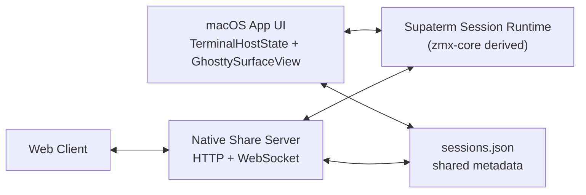
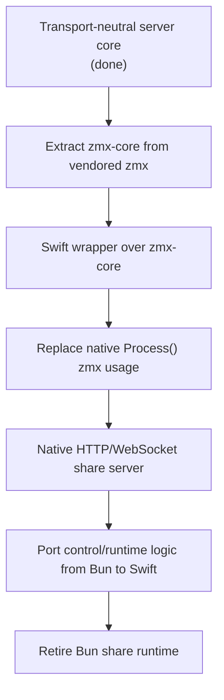

# Option A: Native Share + Native `zmx` Runtime

## Goal

Make the macOS app the canonical owner of:

- pane session runtime
- HTTP/WebSocket share server
- auth token lifecycle
- pane/workspace control flow

The web app becomes a remote client surface onto the running macOS app.

## Why Change

The current stack still has two boundaries that are wrong for the end-state:

1. the macOS app launches an external `supaterm-server`
2. the macOS app and server both execute the `zmx` CLI as another binary

That works as an intermediate step, but it is brittle:

- extra process boundaries
- duplicated lifecycle management
- harder crash/restart semantics
- harder packaging/signing
- no single in-process session owner

## Target Architecture

## Migration Principles

1. Keep pane identity and `paneId -> sessionName` mapping unchanged.
2. Keep `sessions.json` as the shared metadata contract during migration.
3. Move transports first, not product semantics.
4. Extract `zmx` runtime code into a library boundary before replacing the CLI.
5. Prefer parallel compatibility shims over big-bang rewrites.

## Current State

### Already Good

- pane/session model is aligned around durable `zmx` sessions
- native and server share the same persisted session catalog
- share UI exists in the macOS app
- server/web protocol is already explicit in `packages/shared`

### Still Wrong For Option A

- server transport is Bun-owned
- PTY/session runtime is CLI-driven
- native share uses a spawned server process
- `zmx` is still an executable, not a linked runtime

## First Completed Slice

The first migration slice already landed:

- `packages/server/src/pty-manager.ts`
- `packages/server/src/workspace-state.ts`
- `packages/server/src/index.ts`
- `packages/server/src/transport.ts`

This removed Bun websocket types from the PTY/workspace core and replaced them with narrow transport interfaces:

- `ControlClient`
- `PtyClient`

That matters because the share/runtime core can now be hosted by something other than Bun without rewriting pane/session behavior again.

## Remaining Phases

### Phase 1: Extract `zmx-core`

Goal:
- turn vendored `zmx` from an executable-oriented repo into a reusable runtime library

Work:
- move daemon/session lifecycle code out of `ThirdParty/zmx/src/main.zig`
- keep CLI parsing thin
- expose a small C ABI for:
  - create session
  - attach client transport
  - send input
  - resize
  - detach
  - kill
  - fetch history/init payload

Deliverable:
- `zmx-core` static or dynamic library
- thin `zmx` CLI built on top of that library

### Phase 2: Native Session Runtime Wrapper

Goal:
- replace `Process()` / spawned `zmx` calls in the macOS app

Work:
- add a Swift wrapper client around the `zmx-core` C ABI
- replace `ZMXClient` binary execution with direct library calls
- keep `SUPATERM_PANE_SESSION` and current pane mapping unchanged

Deliverable:
- native app directly owns pane session lifecycle

### Phase 3: Native Share Transport

Goal:
- stop launching external `supaterm-server`

Work:
- add native HTTP routing
- add native WebSocket handling for:
  - `/control`
  - `/pty/:paneId`
  - `/api/health`
  - static web assets
- reuse the existing shared message shapes as the protocol contract

Deliverable:
- share button starts an in-process server in the macOS app

### Phase 4: Move Workspace/Control Runtime Into Swift

Goal:
- retire Bun-owned workspace control flow for sharing

Work:
- port control message handling to Swift
- port server snapshot broadcasting to Swift
- keep `sessions.json` merge/tombstone semantics identical

Deliverable:
- native app is the single runtime owner

### Phase 5: Retire Bun Share Runtime

Goal:
- keep web UI if desired, but remove Bun from local sharing

Possible outcome:
- Bun remains only as a dev tool for building the web frontend
- or Bun server is removed entirely from the product path

## Suggested Implementation Order

## Risk Notes

### Highest Risk

- extracting a stable reusable runtime from upstream `zmx`
- matching current IPC/history/init behavior exactly
- preserving macOS and web attach semantics during the transition

### Lower Risk

- HTTP/WebSocket serving in Swift
- auth token handling in Swift
- static asset serving from the app bundle

## Validation Bar

Option A is complete only when this passes against the real macOS app:

1. open native app
2. press Share
3. choose port or accept default
4. confirm listener is on `0.0.0.0:<port>`
5. open web client remotely
6. attach to an existing native pane
7. type in native and observe in web
8. type in web and observe in native
9. close pane and verify session cleanup
10. quit app and verify share server and pane sessions terminate correctly
