# ZMX Native/Web Architecture

## Goal

Explain how Supaterm moved from:

- native panes backed directly by Ghostty-owned processes
- web/server PTYs owned by the Bun server
- separate persistence/runtime concerns

to:

- one durable `zmx` session per pane
- native and web both attaching to the same pane session
- Supaterm owning metadata and routing, not terminal runtime

This is the document to discuss the architecture with someone who does not need to read the code first.

## Executive Summary

The model is now:

- `workspace` = grouping metadata
- `tab` = grouping metadata + split tree
- `pane` = durable terminal identity
- `pane` maps 1:1 to a `zmx` session

Supaterm owns:

- workspaces
- tabs
- split trees
- focused pane selection
- pane IDs
- `paneID -> sessionName` mapping
- shared session catalog persistence

`zmx` owns:

- PTY lifetime
- shell lifetime
- scrollback
- terminal reattach state

Ghostty remains the native renderer/input surface. The web stack remains the browser/UI and websocket bridge. Neither side is the runtime owner anymore.

## Before ZMX

### Native

Before `zmx`, the native app created one real Ghostty surface per pane, and each surface effectively owned its own live shell/process.

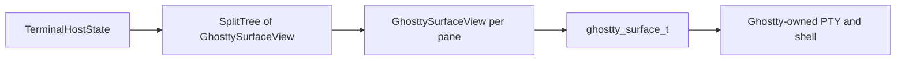

Properties of the old native model:

- pane runtime lived inside the native app process model
- closing the app meant losing pane runtime unless some other mechanism restored it
- native state and terminal runtime were tightly coupled

### Web / Server

Before `zmx`, the Bun server owned PTYs directly.

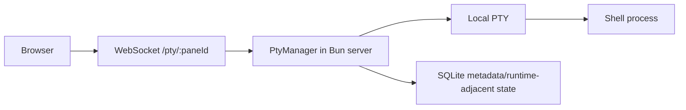

Properties of the old web/server model:

- server created and managed PTYs directly
- server buffered terminal data/runtime state itself
- web and native did not share the same durable terminal identity
- persistence and runtime were mixed together more than needed

## Why This Was Changed

The product goal was:

- a pane should stay meaningfully alive as a terminal identity
- native and web should be able to interact with the same pane
- future share flows should target a stable pane/session, not a transient process

That requires one canonical runtime owner outside either UI.

`zmx` provides exactly that: durable session ownership plus reattach/history support.

## After ZMX

### Core Ownership Model

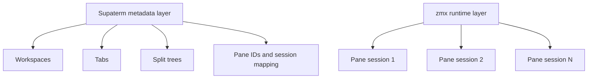

Rule:

- each pane maps 1:1 to a durable `zmx` session

### Native + Web Against Shared Runtime

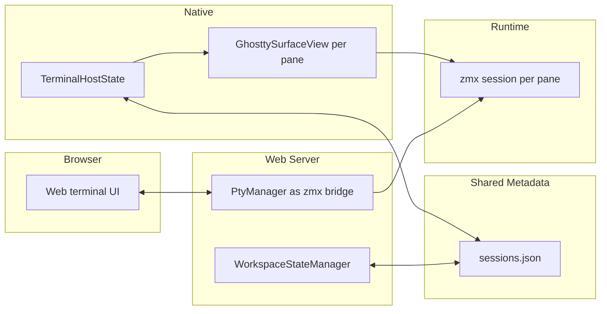

Meaning:

- native and server share one persisted pane catalog
- native and web both attach to the same pane session runtime
- `zmx` is the only runtime owner

## Data Model

## Logical Model

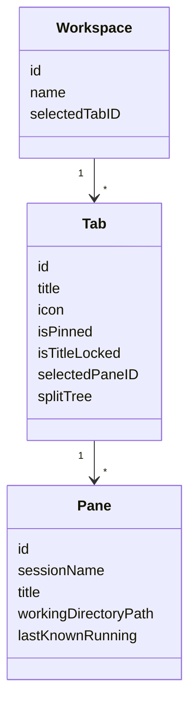

Important distinction:

- `Pane` is the durable terminal identity
- `Tab` is a layout container
- `Workspace` is organization/grouping

### Persisted Catalog

The shared catalog lives at:

- `~/.config/supaterm/sessions.json`

It stores metadata only:

- workspaces
- tabs
- split trees
- selected/focused panes
- `paneID -> sessionName`
- tombstones for deletes

It does not store:

- PTY byte streams
- scrollback as the source of truth
- live process ownership

That runtime state belongs to `zmx`.

### Split Tree

The split tree stays a Supaterm concern.

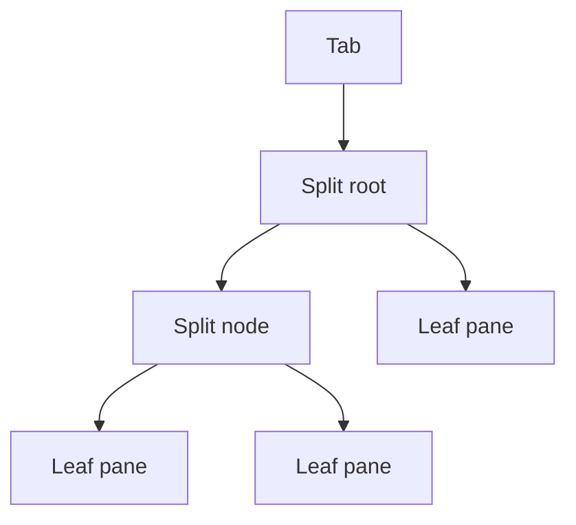

Each leaf points to a pane ID. Each pane ID points to a `zmx` session name.

So the tab layout is separate from the terminal runtime.

## Native Integration

### Old Native Runtime Path

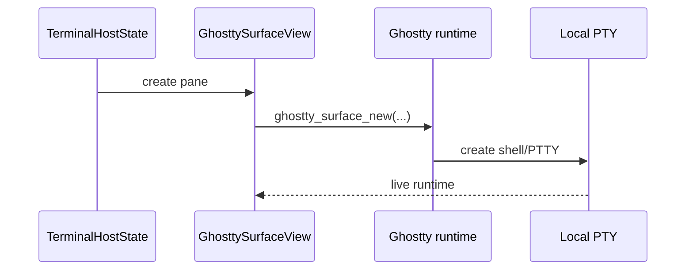

### Current Native Runtime Path

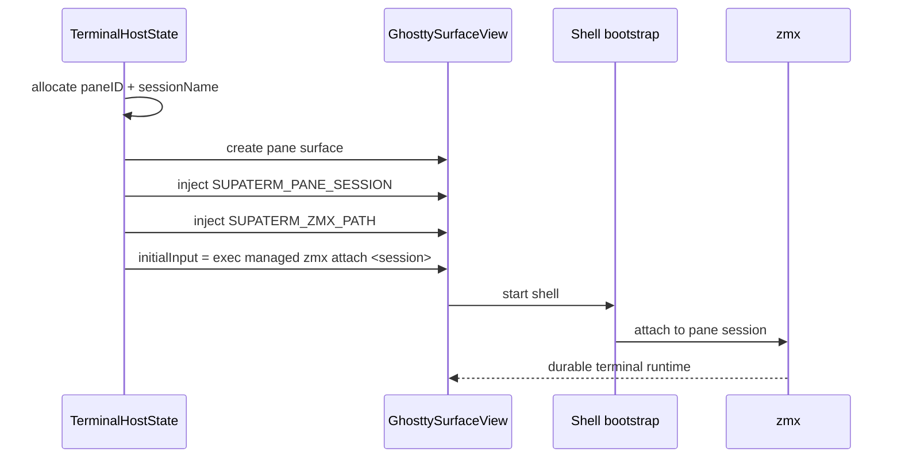

What changed:

- Ghostty still renders and handles input
- Ghostty no longer represents the canonical session owner
- the pane runtime is the attached `zmx` session

### Native Responsibilities Now

- create and destroy panes in the split tree
- persist the session catalog through Sharing
- observe external catalog changes
- attach pane surfaces to the correct managed `zmx` binary
- kill pane sessions on app quit / destructive close

### Native UX Implication

The smooth UX target is:

- opening a pane feels like opening a normal terminal pane
- restoring/reattaching a pane does not require the user to think about `zmx`
- quitting the app kills pane sessions because the current product decision is that app shutdown is destructive

## Web / Server Integration

### Old Web/Server Runtime Path

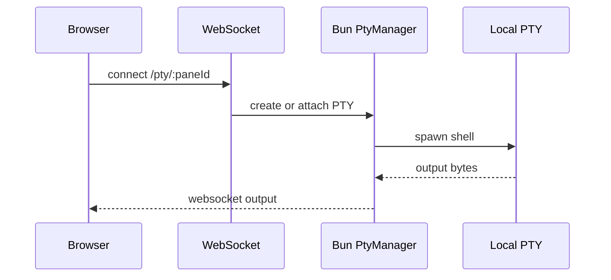

### Current Web/Server Runtime Path

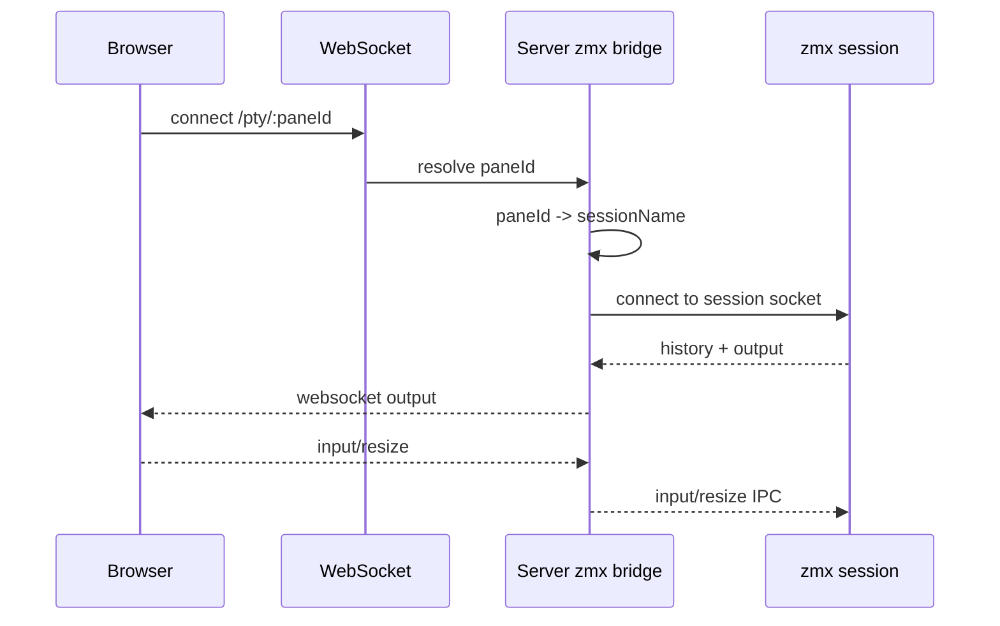

What changed:

- the server is no longer a PTY owner
- the server is a `zmx` session bridge
- the browser and native can interact with the same pane session

### Server Responsibilities Now

- read and write the shared session catalog
- observe live `sessions.json` changes
- resolve pane metadata and session mapping
- bridge websocket traffic to `zmx`
- kill `zmx` sessions on destructive server shutdown paths

### Server UX Implication

The browser should feel like another view onto the same pane, not a separate terminal universe.

## Shared Metadata Flow

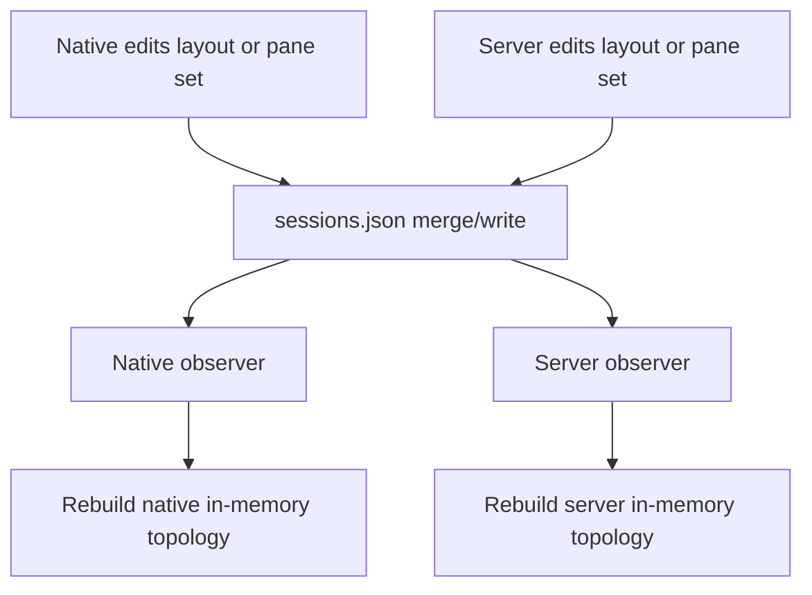

This file is a shared metadata plane, not a runtime stream.

## Pane Lifecycle

### Create Pane

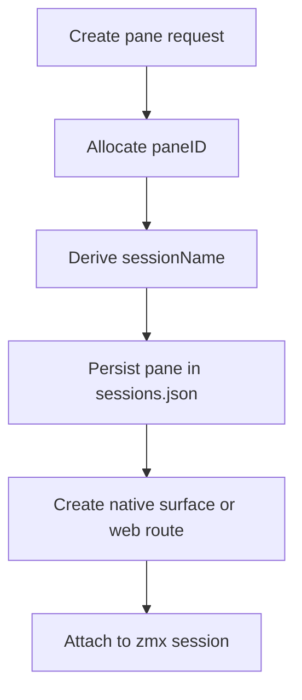

### Close Pane

Current product policy:

- close is destructive
- app quit is destructive
- no user-facing detach mode

So the effective flow is:

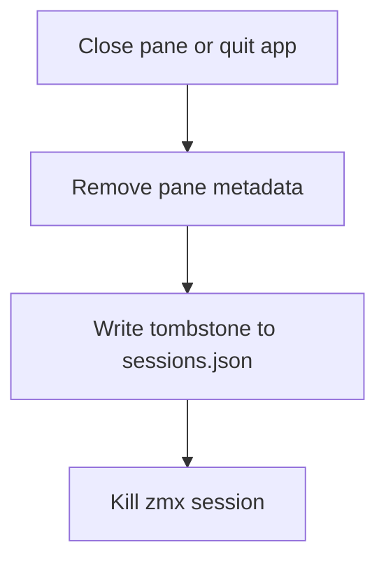

## Conflict Resolution

Because native and server both write the shared catalog, conflict handling matters.

High-level rule:

- metadata is merged by timestamp per entity
- deletes use tombstones
- stale writers do not win just because they save later

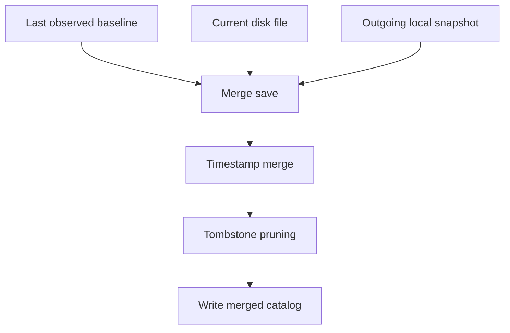

See also:

- [session-catalog-conflict-resolution.md](/Users/hiro/personal/code/supaterm/docs/session-catalog-conflict-resolution.md)

## Managed Binary Model

Another important integration detail is that `zmx` is now treated as a repo-managed build artifact, not an external tool expected on PATH.

### Native

- app embeds vendored `ThirdParty/zmx/zig-out/bin/zmx`
- native pane bootstrap uses `SUPATERM_ZMX_PATH`
- native kill logic resolves bundled binary first, then local vendored binary in dev

### Server

- server resolves vendored `ThirdParty/zmx/zig-out/bin/zmx`
- server startup/build flow requires `make build-zmx`
- no PATH fallback is part of the intended architecture

This matters for UX because:

- app behavior is deterministic
- server behavior is deterministic
- users do not need separate `zmx` installation state to make Supaterm work

## What Stayed The Same

- native still uses GhosttyKit
- `TerminalHostState` still owns surface/view lifecycle
- Supaterm still owns tabs, workspaces, split trees, and selection
- browser still talks to `/pty/:paneId`

So this is not a UI rewrite. It is a runtime ownership rewrite.

## Main Benefits

- native and web now have a path to truly share the same pane runtime
- pane identity is stable enough for future share/send workflows
- runtime and metadata are clearly separated
- persistence is easier to reason about than the old mixed PTY/server ownership model
- the architecture is easier to extend because each layer has a clearer responsibility

## Main Tradeoff

The system is more distributed than before:

- native UI
- server bridge
- shared session catalog
- `zmx` runtime

That adds coordination cost, so keeping ownership boundaries clean is critical.

## Short Version To Discuss

If you want the shortest way to explain it to a friend:

1. Supaterm used to have native panes and web panes backed by different runtime owners.
2. Now each pane is a durable `zmx` session.
3. Native Ghostty and the web terminal are just two clients of that same pane session.
4. Supaterm owns layout and metadata.
5. `zmx` owns terminal runtime.
6. The shared `sessions.json` file is the metadata coordination layer between native and server.
